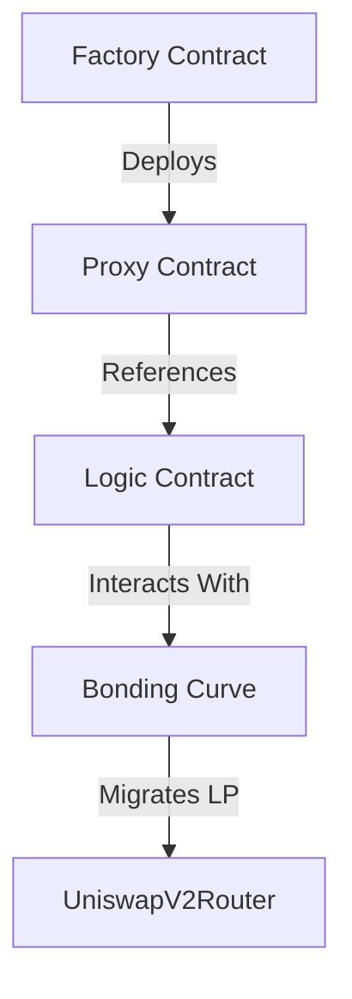

# 🚀 EVM Launchpad - Gas Efficient Token Launchpad Smart Contract

**EVM-compatible Launchpad System** inspired by [pump.fun](https://pump.fun) featuring **zero-liquidity launches** and **automated price discovery** through an exponential bonding curve. Designed for secure, transparent, and efficient token distribution.


[](https://opensource.org/licenses/MIT)


## 📖 Table of Contents
- [Key Features](#-key-features)
- [Architecture](#-architecture)
- [Bonding Curve Mathematics](#-bonding-curve-mathematics)
- [Getting Started](#-getting-started)
- [Deployment](#-deployment)
- [Testing](#-testing)
- [Security](#-security)
- [Contributing](#-contributing)
- [License](#-license)

## 🌟 Key Features

### 🏗 Proxy-Factory Pattern
- **Gas-Optimized Deployment**: reduction in deployment costs through minimalistic clone contracts
- **Upgradeable Logic**: Separate storage and logic contracts for future improvements
- **Standardized Launches**: Uniform contract structure across all launched tokens

### 📈 Exponential Bonding Curve
- **Instant Liquidity**: No pre-locking required - liquidity forms as users buy
- **Fair Price Discovery**: Algorithmic price adjustment based on market activity

### 🔄 Automated Liquidity Migration
- **Seamless Uniswap Transition**: Migrates liquidity to Uniswap V2 at threshold
- **LP Token Distribution**: Fair LP allocation to token holders
- **Price Continuity**: Smooth transition from bonding curve to AMM

## 🏛 Architecture



## 🧮 Bonding Curve Mathematics

### Buy Mechanism
```math
T = \frac{e^{-kS} - e^{-k(S + E)}}{kP₀}
```
T: Tokens received

S: Current ETH supply (contract balance)

E: ETH amount sent

k: Curve steepness parameter

P₀: Initial price per token

### Sell Mechanism
```math
S' = -\frac{\ln(1 - kP₀(T_{total} - T_{in}))}{k}
```
```math
E = S - S'
```
S': New ETH supply after sale

T_total: Total token supply

T_in: Tokens being sold

## 🚀 Getting Started

### Prerequisites
- Foundry (latest version)
- ETH RPC URL (for deployment)
- ETHERSCAN API KEY (for deployment)

### Installation
```bash
# Clone repository
git clone https://github.com/kirilradkov14/launchpad-contracts.git
cd launchpad-contracts

# Install dependencies
forge install

# Setup environment
cp .env.example .env
```

### 🔧 Configuration
Update .env with your settings:

```ini
RPC_URL="https://eth-mainnet.alchemyapi.io/v2/your-key"
PRIVATE_KEY="your_wallet_private_key"
ETHERSCAN_API_KEY="your_etherscan_key"
```

### 🛠️ Build & Test
```bash
# Compile contracts
forge build

# Run all tests
forge test -vvv

# Run specific test suite
forge test --match-contract LaunchpadTests
```

## 🌍 Deployment

### Mainnet
```bash
./deploy.sh mainnet
```

### Testnet
```bash
./deploy.sh holesky
```

### Local Development
```bash
# Start local node
anvil

# In anvil terminal
forge script script/LaunchpadFactory.s.sol:LaunchpadDeployerScript --rpc-url http://localhost:8545 --broadcast
```

## 📊 Test Coverage
```bash
forge coverage --report debug
```

Current Coverage:
- unit tests: 60%
- fuzz tests: 25%

## 🔒 Security

### Audit Status
⚠️ Not Audited - This code is experimental. Use at your own risk.

### Critical Considerations
- Thorough Testing: Always test on testnets with equivalent conditions
- Parameter Validation: Carefully configure curve parameters (k, P₀)
- Migration Thresholds: Set appropriate liquidity migration triggers
- Frontrunning Protection: Consider implementing commit-reveal schemes

## 🤝 Contributing
If (by any chance) you want to contribute:

1. Fork the repository
2. Create your feature branch (git checkout -b feature/amazing-feature)
3. Commit your changes (git commit -m 'Add some amazing feature')
4. Push to the branch (git push origin feature/amazing-feature)
5. Open a Pull Request

## 📜 License
Distributed under the MIT License. See LICENSE for more information.

## ⭐️ Support the Project
If you find this useful, please consider:
- Giving a ⭐️ on GitHub
- Contributing to development
- Following me for more trending projects

Happy launching! 🚀